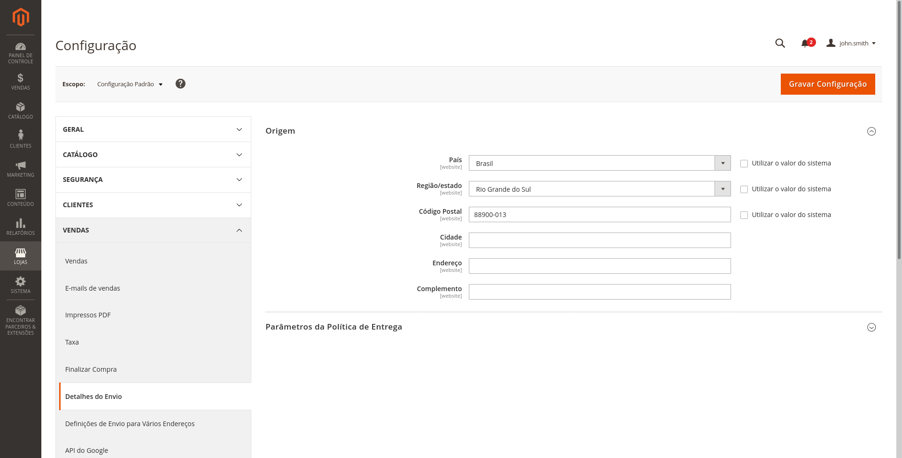
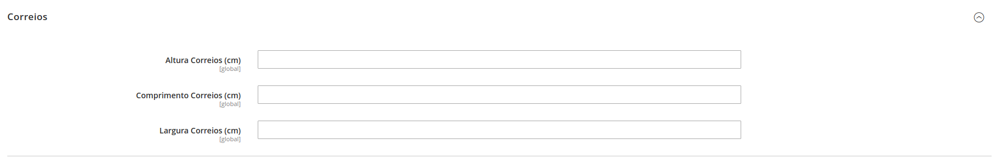
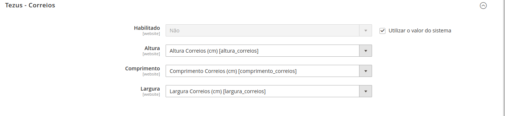
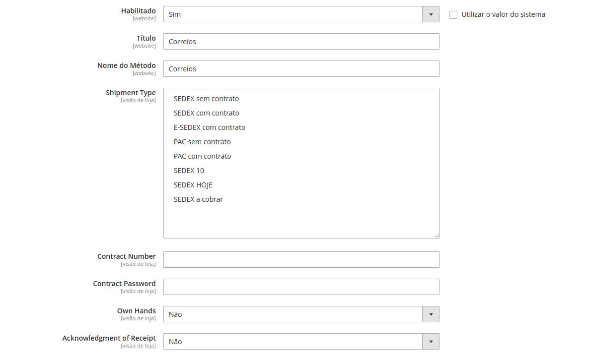
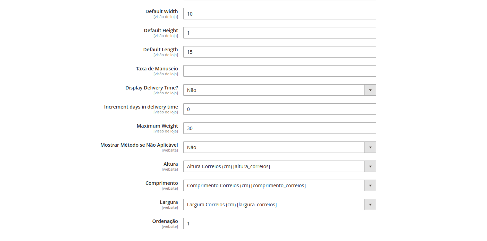
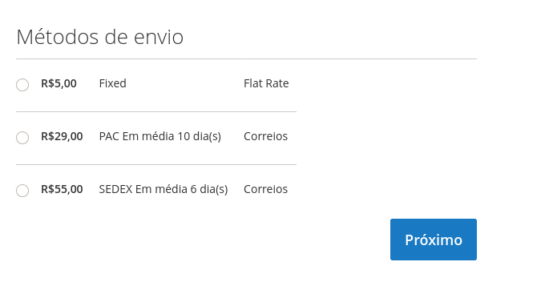

# Tezus Correios

    ``tezus/module-correios``

## Funcionalidades
Módulo para o cálculo de frete e prazo dos correios para lojas em Magento 2.

## Compatibilidade
  - [x] Magento 2.3.3
  - [x] Magento 2.4.0

## Instalação

### Tipo 1: Zip file
 - Clone o repositório a partir do seguinte [Link](https://github.com/tezusecommerce/Correios-Magento-2.git)
 - Na raiz do magento, dentro da pasta App > Code > Crie a pasta Tezus. Ficará da seguinte maneira `app/code/Tezus`.
 - Habilite o módulo executando `php bin/magento module:enable Tezus_Correios`
 - Aplique as atualizações do banco de dados: `php bin/magento setup:upgrade`
 - Limpe o Cache `php bin/magento cache:clean`

### Tipo 2: Composer

 - Make the module available in a composer repository for example:
    - private repository `repo.magento.com`
    - public repository `packagist.org`
    - public github repository as vcs
 - Add the composer repository to the configuration by running `composer config repositories.repo.magento.com composer https://repo.magento.com/`
 - Install the module composer by running `composer require tezus/module-correios`
 - enable the module by running `php bin/magento module:enable Tezus_Correios`
 - apply database updates by running `php bin/magento setup:upgrade`\*
 - Flush the cache by running `php bin/magento cache:flush`

## Configurações

  ### Configurações Core
  
  Em Lojas > Configuração > Vendas > Detalhes do Envio > Preencha os campos de País, Região/Estado e Cep, conforme seu endereço.

  

  Também, em cada Produto será criado 3 campos, sendo eles Altura Correios, Comprimento Correios e Largura Correios. Para que o cálculo seja realizado, estes campos devem ser preenchido. Lembrando que todas as medidas devem ser em CM.

  

  *** OBS: Caso você já possua algum atributo de medida, poderá mapealo utilizando as seguintes opções! ***

  

  ### Configurações do Módulo

  ### Campos
  
  - Habilitado (Obrigatório)
    - Habilita e Desabilita o módulo do correios.

  - Título (Obrigatório)
    - Título do método.

  - Nome do Método (Obrigatório)
    - Nome do método que será exibido no Front End.

   - Shipment Type
    - Tipos de envio disponíveis para o cálculo do frete. 

  - Contract Number e Contract Password
    - Caso possua um contrato com os correios. É este campo que utilizará para enviar suas credenciais.

  - Own Hands
    - Se deseja que o produto seja entregue somente para determinada pessoa.

  - Acknowledgment of Receipt
    - Se deseja Aviso de Recebimento do produto.

  

  - Largura, altura, comprimento padrão
    - Se preenchido, caso o produto não tenha uma informação válida, buscará estes valores. 

  - Taxa de manuseio
   - Taxa a ser somada no cálculo de frete do produto

  - Exibir Prazo de Entrega
    - Exibe ou não o número de dias para a entrega do produto.

  - Incrementar dias ao prazo
    - Número de dias que será adicionado ao prazo de entrega do produto.

  - Maximum Weight
    - Peso máximo do pacote a ser enviado. 

  - Mostrar Método se Não Aplicável 
    - Caso aconteça algum problema, mostra o método com uma mensagem de erro.

  - Altura, Comprimento e Largura
    - Caso já possua um atributo de medida, poderá mapea-lo utilizando estes campos.

  - Ordenação
    - Qual será a posição do método na tela de finalização do pedido.

  
  
  > Caso tenha realizado todas configurações corretamente, terá este resultado no checkout.

  

## Atributos

 - EAV (custom) - Altura Correios (altura_correios)

 - EAV (custom) - Largura Correios (largura_correios)

- EAV (custom) - Comprimento Correios (comprimento_correios)

